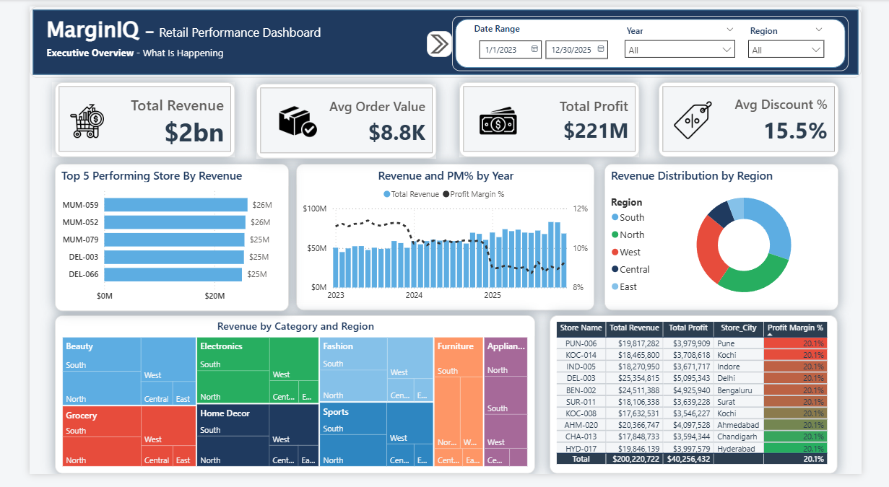
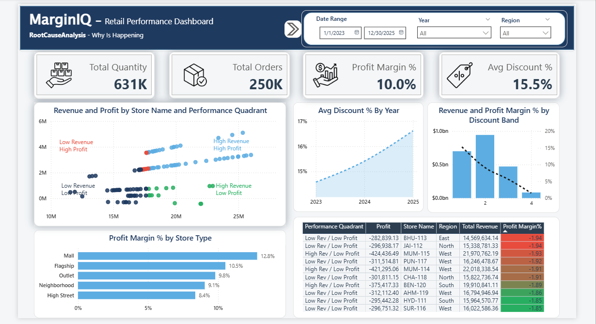
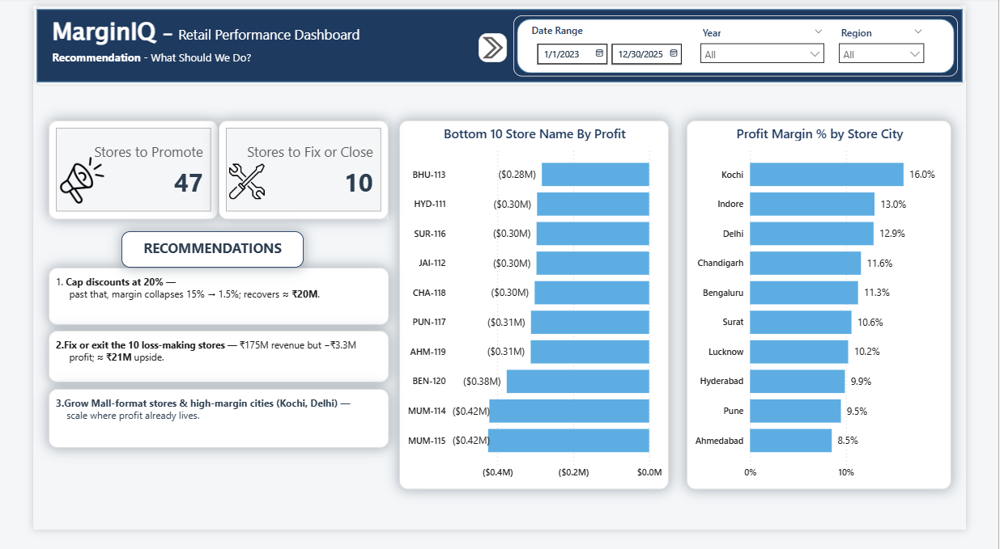

# MarginIQ — Retail Performance Dashboard 📉

*Margin intelligence for retail: where is revenue growing, but profit leaking?*

## 📌 The Problem

A retail chain's **revenue has grown every single year — but profit has not kept pace.** Year after year the
top line climbs, yet profit stays slow and stagnant and the profit margin quietly shrinks. On paper the
business looks healthy; underneath, profitability is stalling.

> **The question leadership is really asking:** *if we're selling more every year, why aren't we earning
> proportionally more?*

This project investigates that gap end-to-end — across 3 years and **250,000+ transactions** — and answers it
in three steps:

1. **What** is happening? — an Executive Overview of revenue, profit and margin.
2. **Why** is it happening? — a Root-Cause analysis of the margin erosion.
3. **How** do we fix it? — data-backed, consulting-style recommendations.

**Headline finding:** revenue grew **+41%** over three years, but profit grew only **+14%** — margin slid
from **11.2% → 9.0%**. The culprit isn't the top line; it's **deepening discounts**, a cluster of
**loss-making stores**, and **weak regions/formats** quietly capping profitability. The fixes are worth an
estimated **~₹40M (+18%) in recoverable profit.**

---

## 📸 Dashboard

| Page 1 — Executive Overview ("What") | Page 2 — Root Cause ("Why") | Page 3 — Recommendations ("How") |
|:---:|:---:|:---:|
|  |  |  |

*Built in Power BI with a custom executive theme (navy / sky-blue / emerald / crimson).*

---

## 🔑 Key insights

- **Discounting is the #1 margin killer.** Margin collapses as discounts deepen — **15.3% at 1–10% off
  down to 1.5% past 30% off** — and nearly two-thirds of revenue sits in the discounted bands.
- **10 stores are running at a loss.** They generate ₹175M of revenue but *lose* ₹3.3M — including
  high-revenue stores (MUM-114/115) that look healthy on the top line but are unprofitable.
- **Geography & format matter.** East region margin is **6%** vs ~11% elsewhere; Mall-format stores run
  **12.8%** margin vs High Street at **8.4%**.
- **The average lies.** Aggregate profitability looks fine — it's masking concentrated pockets of erosion.

## 🧭 Recommendations (sized from the data)

| Action | Evidence | Impact |
|---|---|---|
| Rein in deep discounting (cap ~20%) | margin 15% → 1.5% past 20% off | **≈ ₹20M** |
| Fix or exit the 10 loss-making stores | ₹175M revenue, −₹3.3M profit | **≈ ₹21M** |
| Grow strong formats & cities | Mall 12.8% vs High St 8.4%; Kochi 16% vs Bhubaneswar 6% | structural lift |

---

## 🏗️ Architecture

```
CSV (raw)  ──►  Python (clean + EDA)  ──►  SQL Server (star schema + business logic)  ──►  Power BI (dashboard)
```

- **Python (pandas):** removed duplicate transactions and handled missing values → cleaned CSVs.
- **SQL Server:** a **star schema** (`fact_transactions` + `dim_stores` / `dim_products` / `dim_customers`)
  with foreign keys and indexes, and **two reusable views** carrying the business logic:
  - `vw_sales_enriched` — row-level fact + dimension attributes + derived columns (discount bands, margins, flags)
  - `vw_store_scorecard` — store-level KPIs, ranks and a 4-quadrant performance tag
- **Power BI:** clean star model, cross-page synced slicers, ~8 lightweight DAX measures, custom theme.

## 📂 Repository structure

```
RetailTurnaround/
├── data/
│   ├── raw/         # source datasets (Stores, Products, Customers, transactions)
│   └── clean/       # cleaned output from the Python notebook
├── notebooks/
│   └── 01_data_cleaning.ipynb
├── sql/
│   ├── 01_create_schema.sql   # database + star schema + FKs + indexes
│   ├── 02_load_data.sql       # bulk load the cleaned CSVs
│   └── 03_views.sql           # the two business-logic views
├── powerbi/
│   └── MarginIQ.pbix          # the dashboard
├── design/
│   └── RetailTurnaround_Pastel_Theme.json  # custom Power BI theme
├── images/          # dashboard screenshots
├── requirements.txt
└── README.md
```

## ▶️ How to reproduce

1. **Python** — `pip install -r requirements.txt`, then run
   [`notebooks/01_data_cleaning.ipynb`](notebooks/01_data_cleaning.ipynb) → writes `data/clean/`.
2. **SQL Server** — run the scripts in order against your instance:
   ```
   sqlcmd -S .\SQLEXPRESS -E -C -i sql/01_create_schema.sql
   sqlcmd -S .\SQLEXPRESS -E -C -i sql/02_load_data.sql
   sqlcmd -S .\SQLEXPRESS -E -C -i sql/03_views.sql
   ```
3. **Power BI** — open `powerbi/MarginIQ.pbix`, point it at your SQL Server, refresh.
   (Theme: **View → Themes → Browse** → `design/RetailTurnaround_Pastel_Theme.json`.)

## 🛠️ Tech stack
`Python (pandas)` · `SQL Server 2025 Express` · `Power BI` · `T-SQL` · `DAX`

## 📝 About the data
The dataset is **synthetic**, designed for this case study — no real company data. A realistic
margin-erosion scenario was intentionally engineered (promotional discounts deepening year over year), so
the analysis has a genuine turnaround story to uncover, clean, and diagnose end-to-end.

## 💡 Skills demonstrated
Data cleaning (pandas) · dimensional modelling (star schema) · SQL business logic & views ·
BI dashboard design · data storytelling · consulting-style recommendations.
